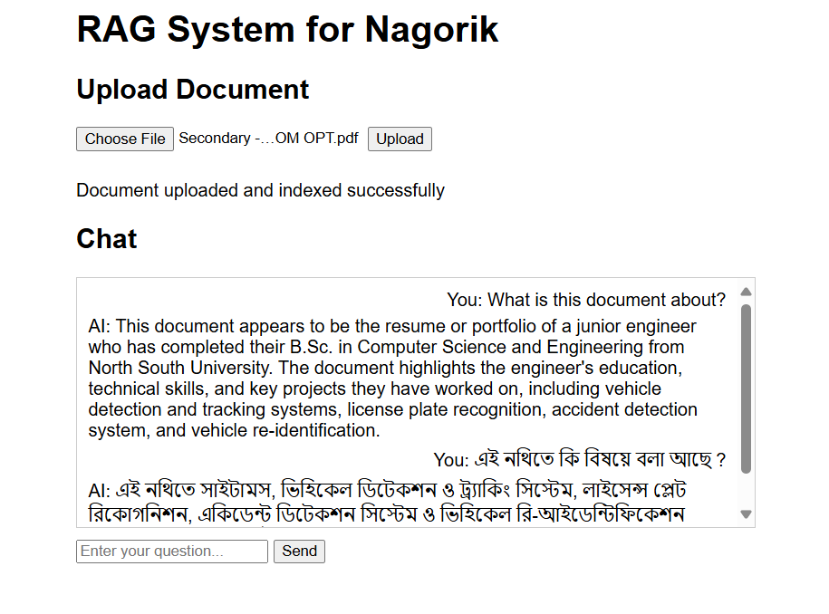

# AI chat bot in Bangla and English for Nagorik Assesment 1

## Installation

```bash
git clone https://github.com/Shehjad-Ishan/rag_web.git
cd rag_web
pip install -r requirments.txt
```
## Pull ollama model
``` bash
ollama pull llama3

```

## Run the application

```bash
 python app.py

```
### The application will be hosted on load sever with port :  http://127.0.0.1:5000



uplaod your document after choosing the file. Enter prompt, hit send and converse with the AI. I have used llama3 for chat model which was trained on Bangla and English data.
For document parsing all-MiniLM-L6-v2 model was used. Should be able to parse bangla document fairly. Although couldn't test it properly.
